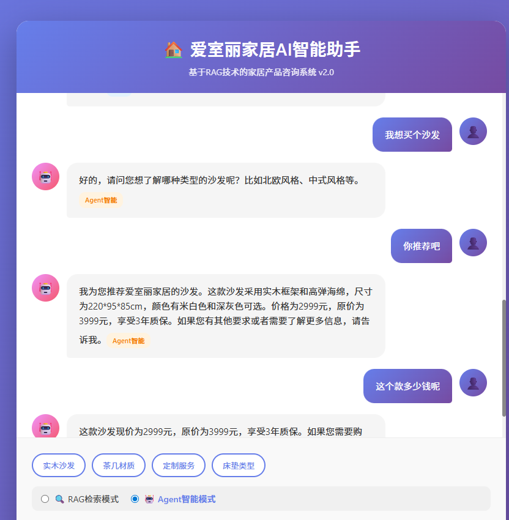

🏠 爱室丽家居 AI 智能助手

基于 RAG 技术的家居产品咨询系统 v2.0

✨ 核心亮点
🤖 Agent 智能模式 — 主动推荐，智能决策

用户只需说"我想买个沙发"，Agent 便能主动调用工具，查询产品库、分析用户偏好、给出个性化推荐，而非机械式的问答。

📌 项目简介

本项目是一个智能客服系统，结合 RAG 检索增强 与 Agent 智能体 双模式，为用户提供家居产品咨询服务。
核心能力

特性	说明
🔄 双模式切换	RAG 检索模式 + Agent 智能模式，按需切换
🧠 语义检索	基于 M3E-Base 模型的精准语义匹配
💬 对话记忆	支持多轮对话、用户偏好记忆
🛠️ 工具调用	Agent 可调用预设工具查询库存、价格、促销信息
📊 缓存机制	相同查询直接命中缓存，降低计算开销
🔐 本地部署	完全本地化部署，数据安全可控

🏗️ 系统架构

mermaid
flowchart TB
    A[用户请求] --> B{模式路由}
    B -->|RAG模式| C[RAG检索引擎]
    B -->|Agent模式| D[Agent智能体]
    C --> E[向量数据库]
    D --> F[工具调用引擎]
    E --> G[缓存层]
    F --> G
    G --> H[LLM服务]

🚀 快速开始
环境要求

Python 3.9+
Milvus 2.3+
8GB+ 内存
安装步骤

bash
git clone https://github.com/your-username/furniture-ai-assistant.git
cd furniture-ai-assistant
python -m venv venv
source venv/bin/activate  # Windows: venv\Scripts\activate
pip install -r requirements.txt
python main.py

接口调用示例

对话接口

bash
curl -X POST "http://localhost:8000/chat" \
  -H "Content-Type: application/json" \
  -d '{"query":"床垫有哪些类型","mode":"rag","user_id":"user001"}'

统计接口

bash
curl http://localhost:8000/stats

📊 功能对比

模式	适用场景	优势
RAG 检索模式	精确查询、产品规格咨询	响应快、准确度高
Agent 智能模式	开放式咨询、个性化推荐	主动决策、工具联动

🛠️ 技术栈

类别	技术
后端框架	FastAPI
LLM 接入	OpenAI API / 本地模型
向量数据库	Milvus
Embedding 模型	M3E-Base
缓存	内存 LRU Cache

📁 项目结构

目录/文件	说明
服务/	服务核心代码
缓存/	缓存模块
数据/	数据文件
日志/	日志与分析
docs/	文档与图片
main.py	启动入口
config.py	配置文件
requirements.txt	依赖清单

🎯 项目亮点

双模式架构设计 — RAG 与 Agent 灵活切换，覆盖不同场景需求
性能优化实践 — 缓存机制减少重复计算，统计接口实时监控
工具调用能力 — Agent 可自主决定调用哪些工具完成任务
完整工程实践 — 日志记录、错误处理、接口设计一应俱全

⭐ 如果这个项目对你有帮助，欢迎 Star 支持！

